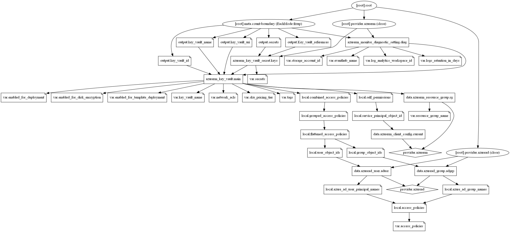

# Azure Key Vault Terraform Module

Terraform Module to create a Key Vault also adds required access policies for AD users and groups. This module also sends all logs to log analytic workspace and storage. 

## Module Usage

```
module "key-vault" {
  source = "github.com/tietoevry-infra-as-code/terraform-azurerm-key-vault?ref=v1.1.0"

  # Resource Group and Key Vault pricing tier details
  resource_group_name        = "rg-tieto-internal-shared-westeurope-002"
  key_vault_sku_pricing_tier = "premium"

  # (Required) Project_Name, Subscription_type and environment are must to create resource names.
  # Project name length should be `15` and contian Alphanumerics and hyphens only. 
  project_name      = "tieto-internal"
  subscription_type = "shared"
  environment       = "dev"

  # Adding Key valut logs to Azure monitoring and Log Analytics space
  log_analytics_workspace_id           = module.hub-spoke-network.log_analytics_workspace_id
  azure_monitor_logs_retention_in_days = 30
  storage_account_id                   = module.hub-spoke-network.storage_account_id

  #specify whether Azure Virtual Machines are permitted to retrieve certificates stored as secrets from the key vault
  enabled_for_deployment = "true"

  #specify whether Azure Disk Encryption is permitted to retrieve secrets from the vault and unwrap keys
  enabled_for_disk_encryption = "true"

  #specify whether Azure Resource Manager is permitted to retrieve secrets from the key vault
  enabled_for_template_deployment = "true"

  # Once `Purge Protection` has been Enabled it's not possible to Disable it
  # Deleting the Key Vault with `Purge Protection` enabled will schedule the Key Vault to be deleted (currently 90 days)
  # Once `Soft Delete` has been Enabled it's not possible to Disable it.
  enable_purge_protection = false
  enable_soft_delete      = false

  # Access policies for users, you can provide list of Azure AD users and set permissions.
  # Make sure to use list of user principal names of Azure AD users.
  access_policies = [
    {
      azure_ad_user_principal_names = ["user1@example.com", "user2@example.com"]
      key_permissions               = ["get", "list"]
      secret_permissions            = ["get", "list"]
      certificate_permissions       = ["get", "import", "list"]
      storage_permissions           = ["backup", "get", "list", "recover"]
    },

    # Access policies for AD Groups, enable this feature to provide list of Azure AD groups and set permissions.
    {
      # azure_ad_group_names = ["ADGroupName1", "ADGroupName2"]
      # secret_permissions   = ["get", "list", "set"]
    },
  ]

  # Create a required Secrets as per your need.
  # When you Add `usernames` with empty password this module creates a strong random password 
  # use .tfvars file to manage the secrets as variables to avoid security issues. 
  secrets = {
    "message" = "Hello, world!"
    "vmpass"  = ""
  }

  # Adding TAG's to your Azure resources (Required)
  # ProjectName and Env are already declared above, to use them here or create a varible. 
  tags = {
    ProjectName  = "tieto-internal"
    Env          = "dev"
    Owner        = "user@example.com"
    BusinessUnit = "CORP"
    ServiceClass = "Gold"
  }
}
```

## Configure Azure Key Vault firewalls and virtual networks

Configure Azure Key Vault firewalls and virtual networks to restrict access to the key vault. The virtual network service endpoints for Key Vault (Microsoft.KeyVault) allow you to restrict access to a specified virtual network and set of IPv4 address ranges.

Default action is set to `Deny` when no network rules matched. A `virtual_network_subnet_ids` or `ip_rules` can be added to `network_acls` block to allow request that is not Azure Services.

``` 
module "key-vault" {
  source = "github.com/tietoevry-infra-as-code/terraform-azurerm-key-vault?ref=v1.1.0"

  # .... omitted

  network_acls = {
    bypass                     = "AzureServices"
    default_action             = "Deny"
    ip_rules                   = ["123.201.18.148"]  # One or more IP Addresses, or CIDR Blocks to access this Key Vault.
    virtual_network_subnet_ids = ["10.1.1.0/24", "10.1.2.0/24", "10.1.3.0/24"] # One or more Subnet ID's to access this Key Vault.
  }
  
# ....omitted

}
```

## Recommended naming and tagging conventions
Well-defined naming and metadata tagging conventions help to quickly locate and manage resources. These conventions also help associate cloud usage costs with business teams via chargeback and show back accounting mechanisms.

> ### Resource naming 
An effective naming convention assembles resource names by using important resource information as parts of a resource's name. For example, using these [recommended naming conventions](https://docs.microsoft.com/en-us/azure/cloud-adoption-framework/ready/azure-best-practices/naming-and-tagging#example-names), a public IP resource for a production SharePoint workload is named like this: `pip-sharepoint-prod-westus-001`.

> ### Metadata tags
When applying metadata tags to the cloud resources, you can include information about those assets that couldn't be included in the resource name. You can use that information to perform more sophisticated filtering and reporting on resources. This information can be used by IT or business teams to find resources or generate reports about resource usage and billing.

The following list provides the recommended common tags that capture important context and information about resources. Use this list as a starting point to establish your tagging conventions.

Tag Name|Description|Key|Example Value|Required?
--------|-----------|---|-------------|---------|
Project Name|Name of the Project for the infra is created. This is mandatory to create a resource names.|ProjectName|{Project name}|Yes
Application Name|Name of the application, service, or workload the resource is associated with.|ApplicationName|{app name}|Yes
Approver|Name	Person responsible for approving costs related to this resource.|Approver|{email}|Yes
Business Unit|Top-level division of your company that owns the subscription or workload the resource belongs to. In smaller organizations, this may represent a single corporate or shared top-level organizational element.|BusinessUnit|FINANCE, MARKETING,{Product Name},CORP,SHARED|Yes
Cost Center|Accounting cost center associated with this resource.|CostCenter|{number}|Yes
Disaster Recovery|Business criticality of this application, workload, or service.|DR|Mission Critical, Critical, Essential|Yes
End Date of the Project|Date when this application, workload, or service is planned to be retired.|EndDate|{date}|No
Environment|Deployment environment of this application, workload, or service.|Env|Prod, Dev, QA, Stage, Test|Yes
Owner Name|Owner of the application, workload, or service.|Owner|{email}|Yes
Requester Name|User that requested the creation of this application.|Requestor|	{email}|Yes
Service Class|Service Level Agreement level of this application, workload, or service.|ServiceClass|Dev, Bronze, Silver, Gold|Yes
Start Date of the project|Date when this application, workload, or service was first deployed.|StartDate|{date}|No

> This module allows you to manage the above metadata tags directly or as a variable using `variables.tf`. All Azure resources which support tagging can be tagged by specifying key-values in argument `tags`. Tag `ResourceName` is added automatically to all resources. 

```
module "key-vault" {
  source = "github.com/tietoevry-infra-as-code/terraform-azurerm-key-vault?ref=v1.1.0"
  create_resource_group   = false

  # ... omitted

  tags = {
    ProjectName  = "PublicCloud"
    Env          = "dev"
    Owner        = "user@example.com"
    BusinessUnit = "CORP"
    ServiceClass = "Gold"
  }
}
```

## Inputs

Name | Description | Type | Default
---- | ----------- | ---- | -------
`resource_group_name` | The name of the resource group in which resources are created | string | `""`
`project_name`|The name of the project|string | `""`
`subscription_type`|Summary description of the purpose of the subscription that contains the resource. Often broken down by deployment environment type or specific workloads|string | `""`
`environment`|The stage of the development lifecycle for the workload that the resource supports|list |`{}`
`key_vault_sku_pricing_tier`|The name of the SKU used for the Key Vault. The options are: `standard`, `premium`.|string|`"standard"`
`enabled_for_deployment`|Allow Virtual Machines to retrieve certificates stored as secrets from the Key Vault|string|`"false"`
`enabled_for_disk_encryption`|Allow Disk Encryption to retrieve secrets from the vault and unwrap keys|string|`"false"`
`enabled_for_template_deployment`|Allow Resource Manager to retrieve secrets from the Key Vault|string|`"false"`
`enable_purge_protection`|Is Purge Protection enabled for this Key Vault?|string|`"false"`
`enable_soft_delete`|Should Soft Delete be enabled for this Key Vault?|string|`"false"`
`access_policies`|List of access policies for the Key Vault|list|`{}`
`azure_ad_user_principal_names`|List of user principal names of Azure AD users|list| `[]`
`azure_ad_group_names`|List of names of Azure AD groups|list|`[]`
`key_permissions`|List of key permissions, must be one or more from the following: `backup`, `create`, `decrypt`, `delete`, `encrypt`, `get`, `import`, `list`, `purge`, `recover`, `restore`, `sign`, `unwrapKey`, `update`, `verify` and `wrapKey`.|list|`[]`
`secret_permissions`|List of secret permissions, must be one or more from the following: `backup`, `delete`, `get`, `list`, `purge`, `recover`, `restore` and `set`. |list|`[]`
`certificate_permissions`|List of certificate permissions, must be one or more from the following: `backup`, `create`, `delete`, `deleteissuers`, `get`, `getissuers`, `import`, `list`, `listissuers`, `managecontacts`, `manageissuers`, `purge`, `recover`, `restore`, `setissuers` and `update`.|list|`[]`
`storage_permissions`|List of storage permissions, must be one or more from the following: `backup`, `delete`, `deletesas`, `get`, `getsas`, `list`, `listsas`, `purge`, `recover`, `regeneratekey`, `restore`, `set`, `setsas` and `update`. |list|`[]`
`network_acls`|Configure Azure Key Vault firewalls and virtual networks|list| `{}`
`secrets`|A map of secrets for the Key Vault|map| `{}`
`log_analytics_workspace_id`|The id of log analytic workspace to send logs and metrics.|string|`"null"`
`storage_account_id`|The id of storage account to send logs and metrics|string|`"null"`
`azure_monitor_logs_retention_in_days`|The monitor data retention in days|number|`30`
`Tags`|A map of tags to add to all resources|map|`{}`

## Outputs

Name | Description
---- | -----------
`key_vault_id`|The ID of the Key Vault
`key_vault_name`|Name of key vault created
`key_vault_uri`|The URI of the Key Vault, used for performing operations on keys and secrets
`secrets`|A mapping of secret names and URIs
`Key_vault_references`|A mapping of Key Vault references for App Service and Azure Functions

## Resource Graph



## Authors

Module is maintained by [Kumaraswamy Vithanala](mailto:kumaraswamy.vithanala@tieto.com) with the help from other awesome contributors.

## Other resources

* [Azure Key Vault documentation (Azure Documentation)](https://docs.microsoft.com/en-us/azure/key-vault/)

* [Terraform AzureRM Provider Documentation](https://www.terraform.io/docs/providers/azurerm/index.html)